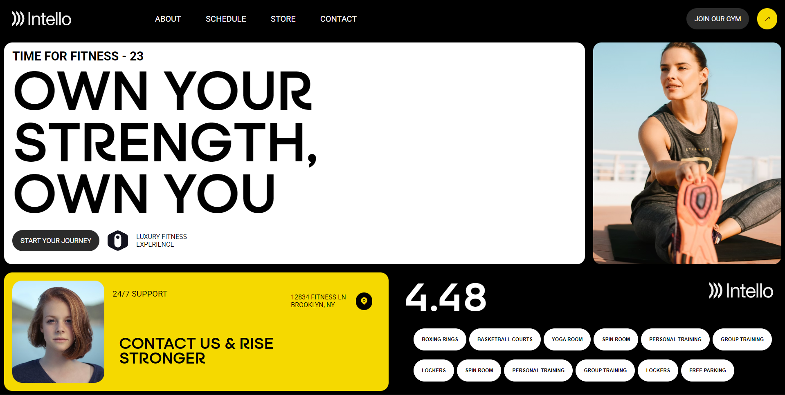

# 🏋️‍♂️ Gym / Fitness Landing Page

A modern and visually striking **fitness/gym landing page** built using **HTML and CSS (SCSS-style nesting)**. This project focuses on clean layout, bold typography, smooth hover effects, and a premium dark–light UI design.

---

## 🔍 Preview

> 📸 Project Preview
(Add a screenshot of your project here after running it locally)



👉 Tip: Take a screenshot of your webpage, name it `preview.png`, and place it in the root folder.

---

## ✨ Features

- Modern gym & fitness website UI
- CSS Grid–based layout
- Custom fonts (Roboto & Surgena)
- Smooth hover animations
- Dark & light color contrast
- Clean and scalable structure
- Beginner-friendly front-end project

---

## 🛠️ Tech Stack

- **HTML5** – Semantic structure
- **CSS3** – Styling & layout
- **CSS Grid & Flexbox**
- **SCSS-style nesting** (can be compiled if needed)
- **Remix Icon** for icons

---

## 📂 Folder Structure

```bash
project-folder/
│
├── index.html
├── style.css
├── preview.png
├── images/
│   ├── intello_wordmark_light.svg
│   └── refine_light.svg
└── fonts/

## 🚀 How to Run Locally

1. Clone the repository
```bash
git clone https://github.com/your-username/gym-landing-page.git
```
2. Open the project folder
```bash
cd gym-landing-page
```
3. Open the index.html file in your preferred code editor

## 📚 What You’ll Learn

- Creating complex layouts using **CSS Grid**
- Combining **Grid with Flexbox** for flexible designs
- Working with **custom fonts** and typography
- Designing modern and clean **UI components**
- Writing **scalable, maintainable, and readable CSS**

## 🧠 Future Improvements

- Add full mobile responsiveness
- Convert SCSS-style CSS into actual SCSS
- Add JavaScript interactions
- Deploy the project using **GitHub Pages**

---

## 👨‍💻 Author

**Subham**
Aspiring Front-End Developer 🚀
